# 📊 Smart Dataset Analyzer

A professional **Streamlit-based Data Analysis application** that performs **Exploratory Data Analysis (EDA)** on CSV datasets and generates an automated PDF report with actionable insights.

The application is designed to help students, data analysts, and machine learning beginners quickly understand the quality, structure, and readiness of a dataset before building machine learning models.

---

## 🌐 Live Demo

🚀 **Application:**  

```
https://smart-dataset-analyzer-v1.streamlit.app/
```

---

# ✨ Features

## 📁 Dataset Upload

- Upload CSV datasets
- Automatic dataset validation
- Displays dataset name, rows, and columns

---

## 📊 Dataset Overview

- Dataset dimensions
- Memory usage
- Column data types
- Dataset preview
- Quick summary

---

## 🧹 Data Quality Analysis

- Missing value analysis
- Duplicate rows
- Duplicate columns
- Constant columns
- Memory-heavy columns
- Missing value visualization

---

## 📈 Statistics

### Numerical Statistics

- Mean
- Median
- Mode
- Variance
- Standard Deviation
- Minimum
- Maximum
- Quartiles
- IQR
- Skewness
- Kurtosis

### Categorical Statistics

- Unique values
- Most common value
- Frequency table

---

## 📉 Visualizations

- Histogram
- KDE Plot
- Box Plot
- Bar Chart
- Missing Value Chart

---

## 🔗 Correlation Analysis

- Correlation Matrix
- Correlation Heatmap
- Strongest Positive Relationships
- Strongest Negative Relationships
- Interactive Scatter Plot

---

## ⚠ Outlier Detection

Supports two detection methods:

- IQR Method
- Z-Score Method

Includes:

- Outlier summary
- Threshold values
- Box Plot
- Outlier table

---

## ⚙ Feature Engineering Recommendations

Automatically suggests improvements such as:

- Missing value handling
- Encoding recommendations
- Scaling recommendations
- Date feature extraction

---

## ❤️ Dataset Health Score

Calculates an overall dataset quality score based on:

- Missing Values
- Duplicate Rows
- Outliers
- Dataset Structure
- Machine Learning Readiness

Also provides:

- Score Breakdown
- Quality Indicators
- Improvement Suggestions

---

## 📄 Automated PDF Report

Generate a professional PDF report containing:

- Dataset Overview
- Statistics
- Missing Value Analysis
- Data Quality Summary
- Correlation Summary
- Outlier Summary
- Feature Engineering Recommendations
- Dataset Health Score
- Improvement Suggestions

---

# 🛠 Tech Stack

### Frontend

- Streamlit

### Backend

- Python

### Data Processing

- Pandas
- NumPy

### Visualization

- Matplotlib
- Seaborn

### Machine Learning Utilities

- SciPy
- Scikit-learn

### Report Generation

- ReportLab

---

# 🚀 Getting Started

## 1️⃣ Clone the Repository

```bash
git clone https://github.com/sandeep-060/smart-dataset-analyzer.git
```

---

## 2️⃣ Navigate to the Project

```bash
cd smart-dataset-analyzer
```

---

## 3️⃣ Create a Virtual Environment

### Windows

```bash
python -m venv .venv
```

Activate:

```bash
.venv\Scripts\activate
```

### macOS / Linux

```bash
python3 -m venv .venv
```

Activate:

```bash
source .venv/bin/activate
```

---

## 4️⃣ Install Dependencies

```bash
pip install -r requirements.txt
```

---

## 5️⃣ Run the Application

```bash
streamlit run app.py
```

The application will open automatically in your browser.

---

# 📄 Supported Dataset

Currently supported:

- ✅ CSV (.csv)

---

# 📌 Future Improvements

- Excel (.xlsx) support
- Interactive Plotly visualizations
- Dataset comparison
- Custom report templates
- Export charts
- Data preprocessing pipeline
- Dark mode optimization

---

# 🤝 Contributing

Contributions, issues, and feature requests are welcome.

Feel free to fork the repository and submit a pull request.

---

# 👨‍💻 Author

**T. Sandeep**

GitHub:
> https://github.com/sandeep-060

LinkedIn:

>https://linkedin.com/in/sandeep-tharala-7291022b8

---

## 📸 Screenshots

## 📸 Application Preview

### Home

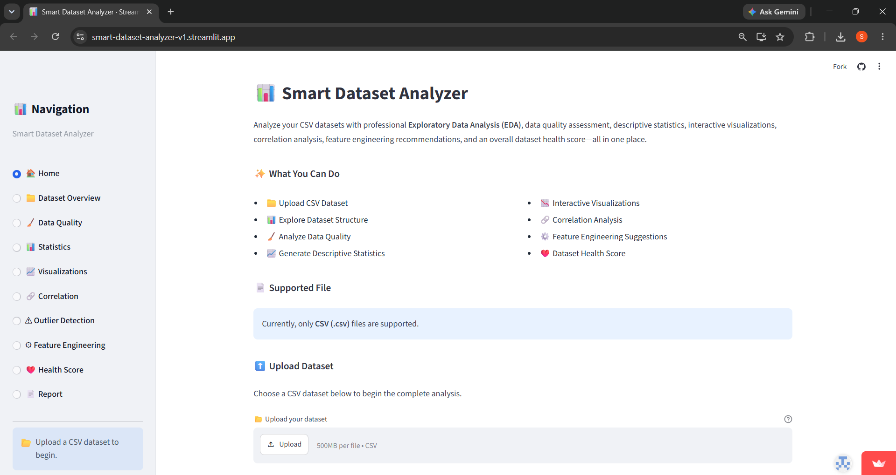
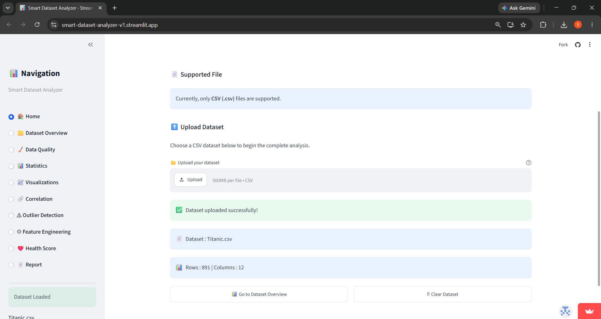

### Dataset Overview

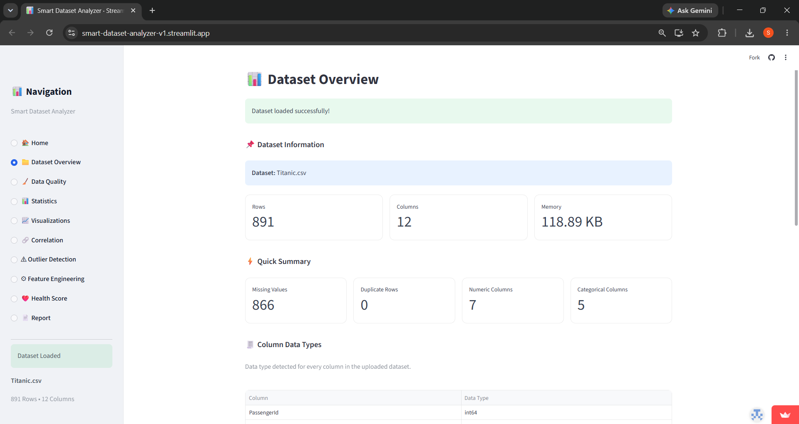

### Data Quality

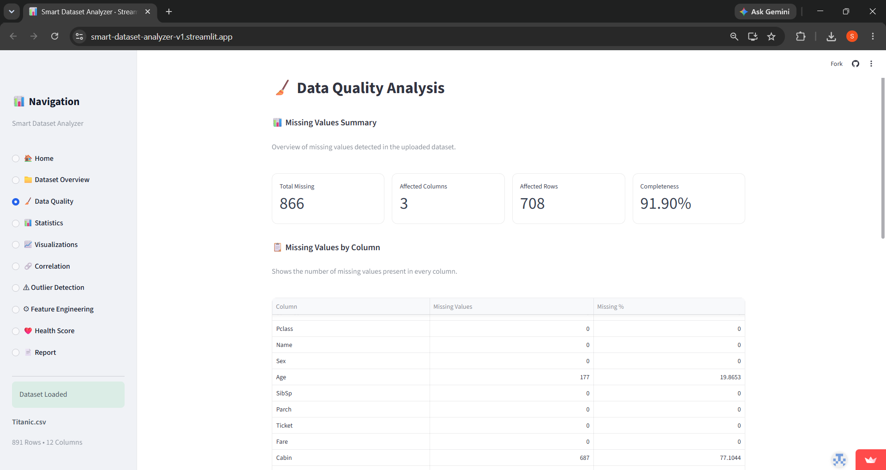
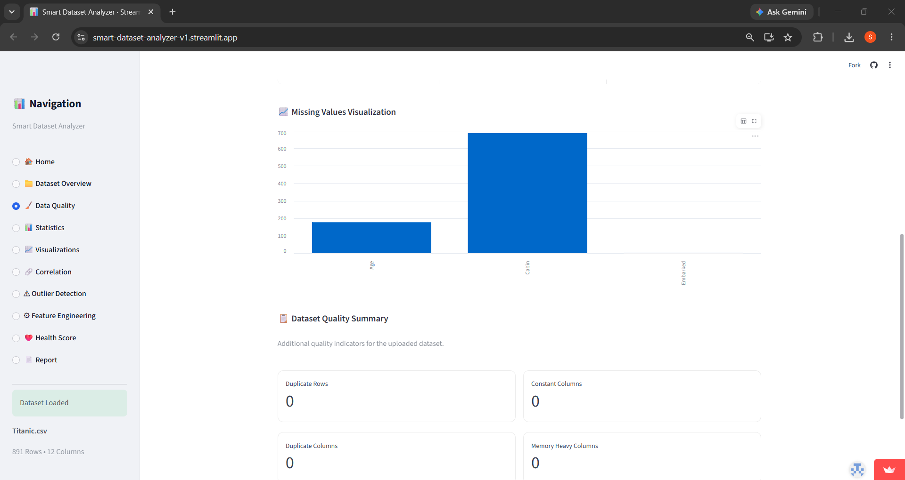

### Statistics

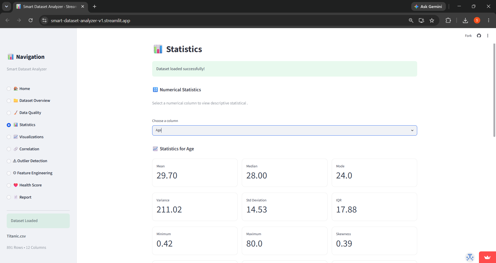
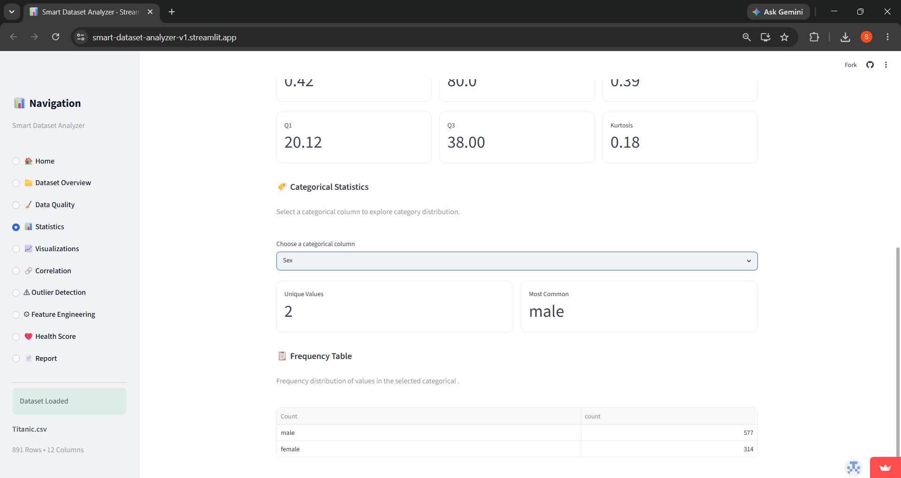

### Visualizations

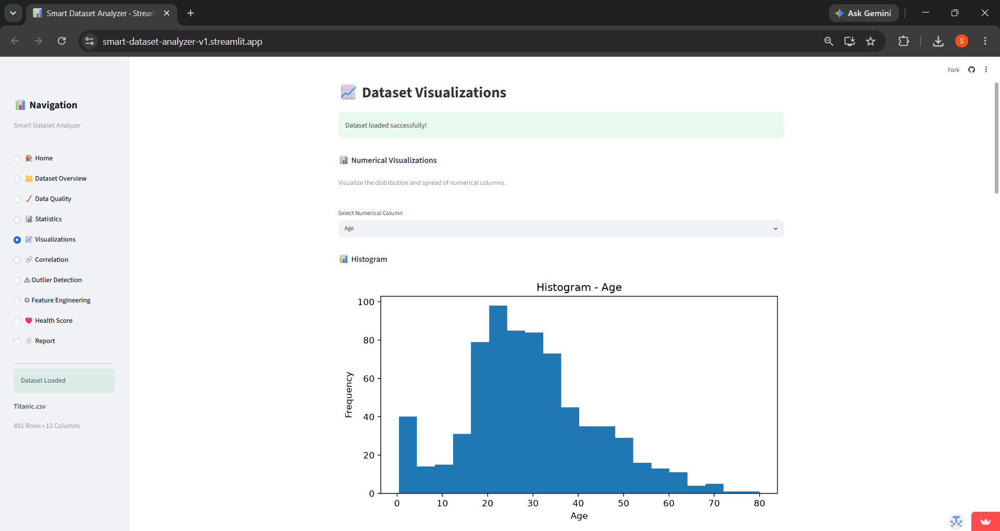
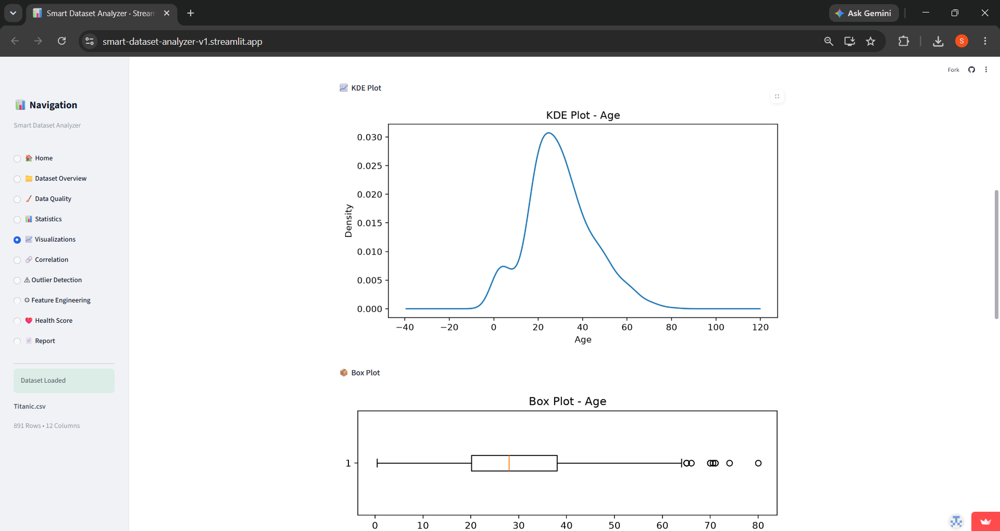
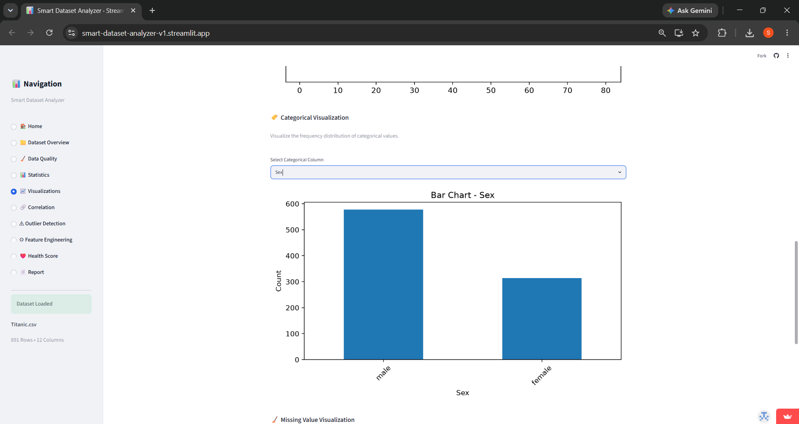
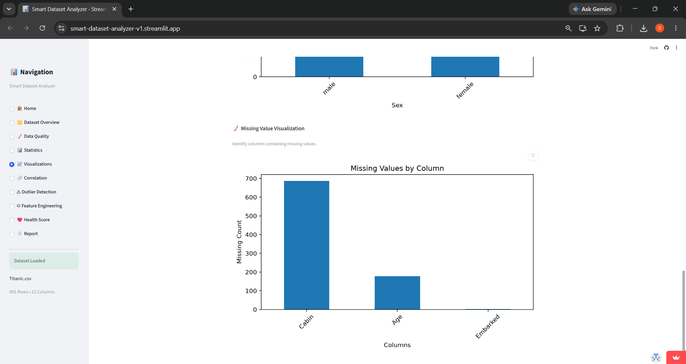

### Correlation

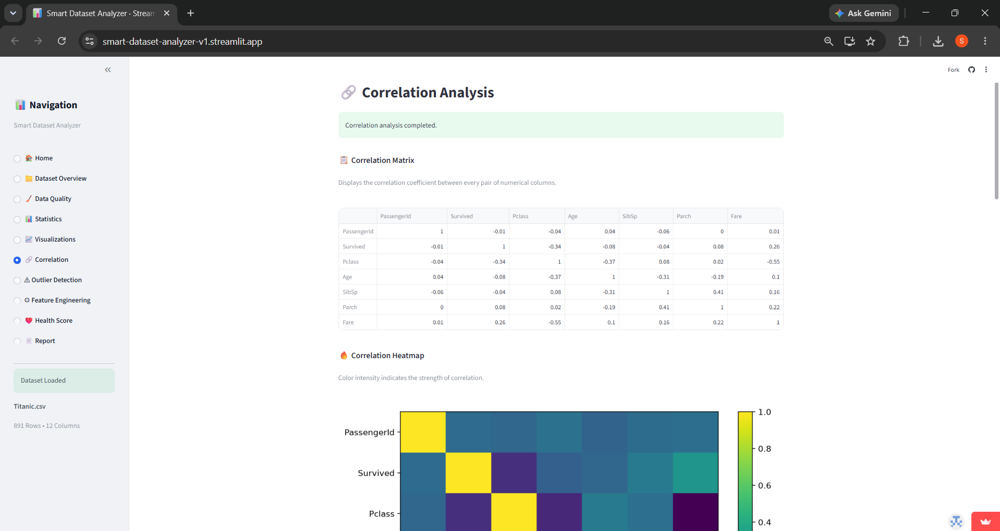
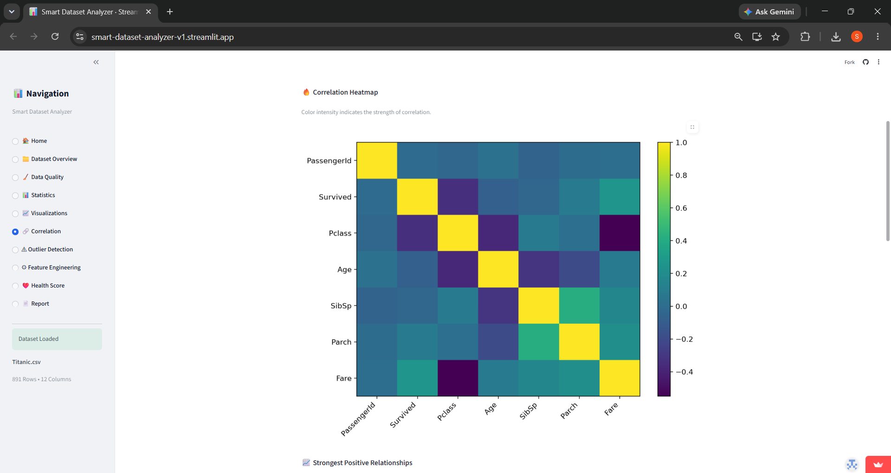
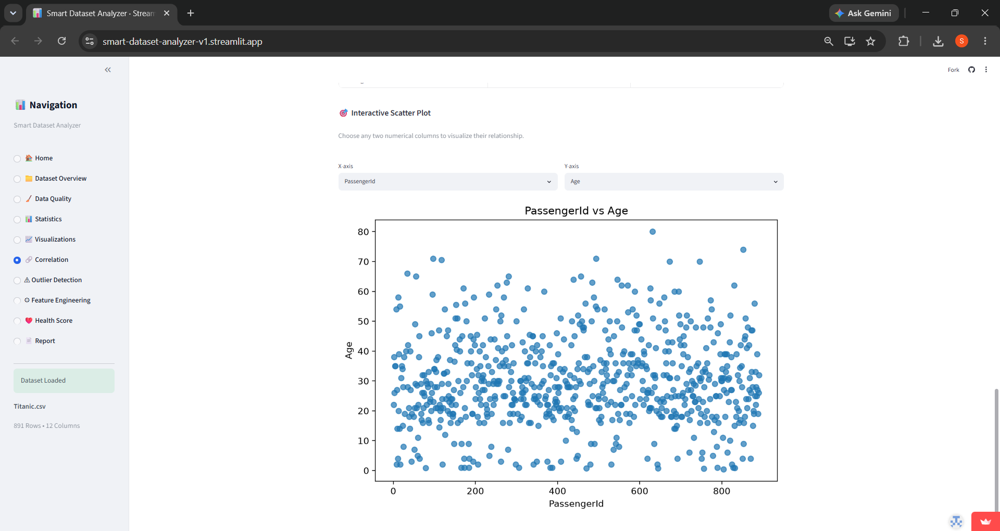

### Outliers

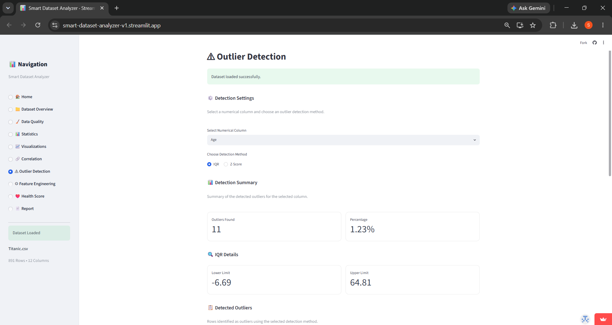
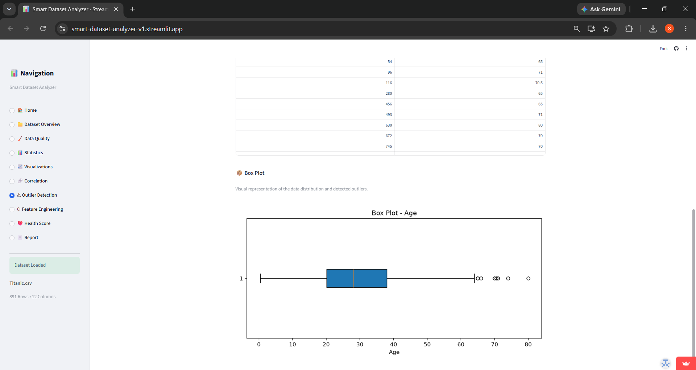

### Feature Engineering


### Health Score


### Report

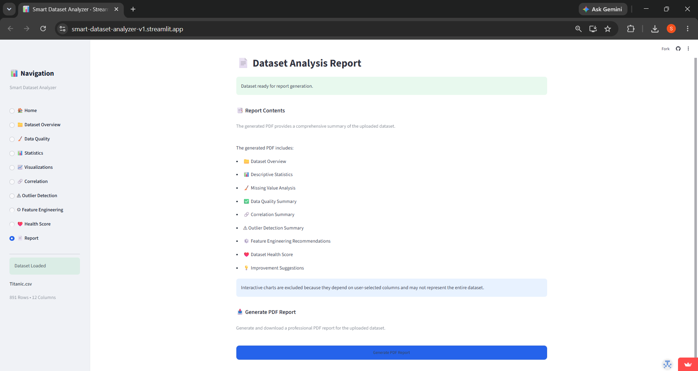
---

# ⭐ Support

If you found this project useful, consider giving it a ⭐ on GitHub.

It helps others discover the project and supports future improvements.

---

